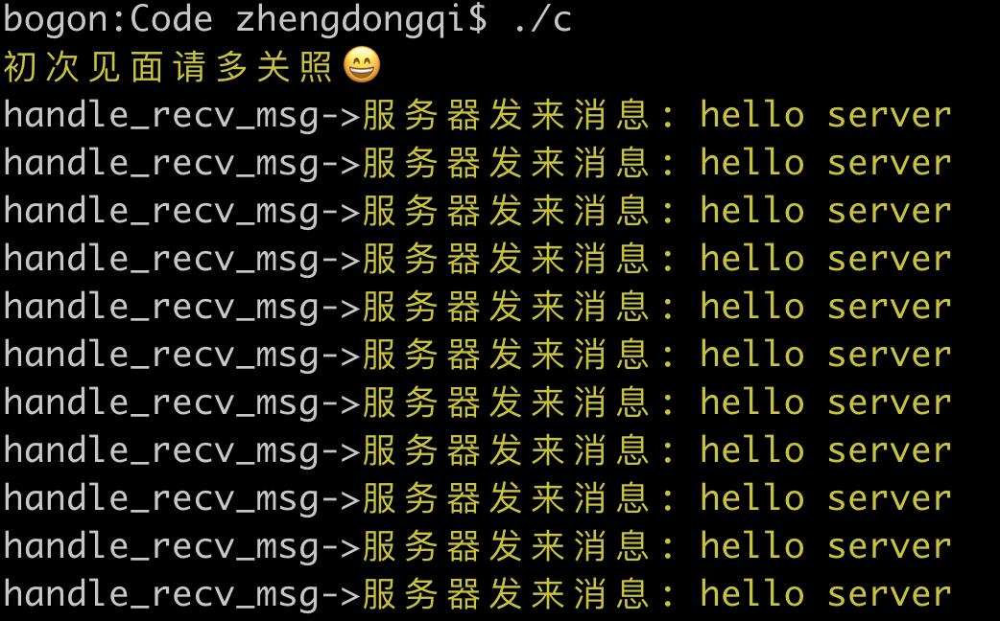

## select原理

该函数准许进程指示内核等待多个事件中的任何一个发送，并只在有一个或多个事件发生或经历一段指定的时间后才唤醒。

## select函数

```c
#include <sys/select.h>
#include <sys/time.h>

int select(int maxfdp1, fd_set *readset, fd_set *writeset, fd_set *exceptset, const struct timeval *timeout)
```

> 函数参数介绍如下：
>
> （1）第一个参数maxfdp1指定待测试的描述字个数，它的值是待测试的最大描述字加1（因此把该参数命名为maxfdp1），描述字0、1、2...maxfdp1-1均将被测试。因为文件描述符是从0开始的。
>
> （2）中间的三个参数readset、writeset 和 exceptset 指定我们要让内核测试读、写和异常条件的描述字。如果对某一个的条件不感兴趣，就可以把它设为空指针。struct fd_set可以理解为一个集合，这个集合中存放的是文件描述符，可通过以下四个宏进行设置：
>
> ```c
> 		void FD_ZERO(fd_set *fdset);           //清空集合
> 
> ​ 	void FD_SET(int fd, fd_set *fdset);    //将一个给定的文件描述符加入集合之中
> 
> ​   void FD_CLR(int fd, fd_set *fdset);    //将一个给定的文件描述符从集合中删除
> 
> ​   int FD_ISSET(int fd, fd_set *fdset);   // 检查集合中指定的文件描述符是否可以读写 
> ```
>
> （3）timeout告知内核等待所指定描述字中的任何一个就绪可花多少时间。其timeval结构用于指定这段时间的秒数和微秒数。
>
> ```c
> struct timeval {
> 
> ​ 		long tv_sec;   //seconds
> 
> ​     long tv_usec;  //microseconds
> 
> ​ };
> ```
>
> 这个参数有三种可能：
>
> （1）永远等待下去：仅在有一个描述字准备好I/O时才返回。为此，把该参数设置为空指针NULL。
>
> （2）等待一段固定时间：在有一个描述字准备好I/O时返回，但是不超过由该参数所指向的timeval结构中指定的秒数和微秒数。
>
> （3）根本不等待：检查描述字后立即返回，这称为轮询。为此，该参数必须指向一个timeval结构，而且其中的定时器值必须为0。

## select测试

服务器端

```c
/*************************************************************************
	> File Name: select_server.c
	> Author: zhengdongqi
	> Mail: 1821260963@qq.com
	> Created Time: 一  4/ 8 16:04:11 2019
 ************************************************************************/

#include <stdio.h>
#include <stdlib.h>
#include <string.h>
#include <errno.h>
#include <unistd.h>
#include <assert.h>
#include <sys/select.h>
#include <sys/socket.h>
#include <sys/types.h>
#include <arpa/inet.h>

#ifdef _DEBUG
#define DBG(fmt, args...) printf(fmt, ##args)
#else
#define DBG(fmt, args...)
#endif

#define IPADDR "192.168.2.165"
#define PORT 8888
#define MAXSIZE 1024
#define LISTENQ 5
#define SIZE 10

/*定义一个结构体存放数据信息*/
typedef struct date_t {
    int cli_cnt; /*客户数量*/
    int cli_fds[SIZE]; /*客户套接字*/
    fd_set allfds; /*句柄集合*/
    int maxfd; /*句柄最大值*/
}date_t;
date_t *cli_d = NULL;

/*函数声明*/
/*创建一个socket 类型TCP*/
int socket_create_tcp(int port);
/*创建一个接收函数*/
int socket_accept_tcp(int sockfd);
/*处理收到的消息*/
int handle_recv_msg(int fd, char *buf);s
 /*接收消息*/
void socket_recv_msg(fd_set *rset);
/*select处理函数*/
void handle_select_proc(int sockfd);
/*创建一个socket 类型TCP*/
/*销毁数据*/
void date_destroy();
/*初始化*/
int socket_init();

int main() {
    DBG("\033[33m很高兴为您服务💁\033[0m\n");
    fflush(stdout);
    int fd;
    /*初始化服务端*/
    if (socket_init() < 0) {
        return -1;
    }
    /*创建服务,开始监听客户端请求*/
    fd = socket_create_tcp(PORT);
    if (fd < 0) {
        DBG("\033[31m套接字创建失败\033[0m\n");
        return -1;
    }
    /*开始接收并处理客户端请求*/
    handle_select_proc(fd);
    date_destroy();
    return 0;
}
/*创建一个socket 类型TCP*/
int socket_create_tcp(int port) {
    int socket_fd;
    struct sockaddr_in socket_addr;
    //创建套接字
    socket_fd = socket(AF_INET, SOCK_STREAM, 0);
    if (socket_fd < 0) {
        DBG("socket_create_tcp->\033[31m创建套接字失败: %s\033[0m\n", strerror(errno));
        close(socket_fd);
        return -1;
    }
    //设置服务器
    memset(&socket_addr, 0, sizeof(socket_addr));//数据初始化清零
    socket_addr.sin_family = AF_INET;//设置协议族
    socket_addr.sin_port = htons(port);//端口
    socket_addr.sin_addr.s_addr = htonl(INADDR_ANY);//IP地址
    //端口重用
    int reuse = 1;
    if (setsockopt(socket_fd, SOL_SOCKET, SO_REUSEADDR, &reuse, sizeof(reuse)) == -1) {
        DBG("socket_create_tcp->\033[31m设置端口重用失败: %s\033[0m\n", strerror(errno));
        close(socket_fd);
        return -1;
    }
    //绑定连接
    if (bind(socket_fd, (struct sockaddr*)&socket_addr, sizeof(struct sockaddr)) < 0) {
        DBG("socket_create_tcp->\033[31m绑定失败: %s\033[0m\n", strerror(errno));
        close(socket_fd);
        return -1;
    }
    //设置监听
    if (listen(socket_fd, 20) < 0) {
        DBG("socket_create_tcp->\033[31m监听失败: %s\033[0m\n", strerror(errno));
        close(socket_fd);
        return -1;
    }
    return socket_fd;
}
/*创建一个接收函数*/
int socket_accept_tcp(int sockfd) {
    int afd = -1;
    struct sockaddr_in accept_addr;
    int len = sizeof(accept_addr);

    afd = accept(sockfd, (struct sockaddr *)&accept_addr, (socklen_t *)&len);

    if (afd == -1) {
        DBG ("socket_accept_tcp->\033[31m接收失败: %s\033[0m\n", strerror(errno));
        return -1;
    }

    //将新的连接描述符添加到数组中
    int i = 0;
    for (i = 0; i < SIZE; i++) {
        if (cli_d->cli_fds[i] < 0) {
            cli_d->cli_fds[i] = afd;
            cli_d->cli_cnt++;
            break;
        }
    }

    if (i == SIZE) {
        DBG("socket_accept_tcp->\033[31m太多客户了 好累啊😢\033[0m\n");
        fflush(stdout);
        return -1;
    }
    return 0;
}
/*处理收到的消息*/
int handle_recv_msg(int fd, char *buf) {
    assert(buf);
    printf("handle_recv_msg->\033[32mrecv buf is :%s\033[0m\n", buf);
    write(fd, buf, strlen(buf) +1);
    return 0;
}
/*接收消息*/
void socket_recv_msg(fd_set *rset) {
    int i = 0, n = 0;
    int fd;
    char buf[MAXSIZE] = {0};
    for (i = 0; i <= cli_d->cli_cnt; i++) {
        fd = cli_d->cli_fds[i];
        if (fd < 0) {
            continue;
        }
        /*判断客户端套接字是否有数据*/
        if (FD_ISSET(fd, rset)) {
            //接收客户端发送的信息
            n = read(fd, buf, MAXSIZE);
            if (n <= 0) {
                /*n==0表示读取完成，客户都关闭套接字*/
                FD_CLR(fd, &cli_d->allfds);
                close(fd);
                cli_d->cli_fds[i] = -1;
                continue;
            }
            handle_recv_msg(fd, buf);
        }
    }
}
/*select处理函数*/
void handle_select_proc(int sockfd) {
    int fd = -1;
    int nfd = 0;
    fd_set *rset = &cli_d->allfds;
    struct timeval tv;
    int i = 0;

    while (1) {
        /*每次调用select前都要重新设置文件描述符和时间，因为事件发生后，文件描述符和时间都被内核修改啦*/
        FD_ZERO(rset);
        /*添加监听套接字*/
        FD_SET(sockfd, rset);
        cli_d->maxfd = sockfd;

        tv.tv_sec = 30;
        tv.tv_usec = 0;

        /*添加客户端套接字*/
        for (i = 0; i < cli_d->cli_cnt; i++) {
            fd = cli_d->cli_fds[i];
            /*去除无效的客户端句柄*/
            if (fd != -1) {
                FD_SET(fd, rset);
            }
            cli_d->maxfd = (fd > cli_d->maxfd ? fd : cli_d->maxfd);
        }

        /*开始轮询接收处理服务端和客户端套接字*/
        nfd = select(cli_d->maxfd + 1, rset, NULL, NULL, &tv);
        if (nfd == -1) {
            DBG("handle_socket_select->\033[31mselect失败: %s\033[0m\n", strerror(errno));
            return ;
        }
        if (nfd == 0) {
            DBG("handle_socket_select->\033[31mselect超时: %s\033[0m\n", strerror(errno));
            continue;
        }
        if (FD_ISSET(sockfd, rset)) {
            /*监听客户端请求*/
            socket_accept_tcp(sockfd);
        } else {
            /*接受处理客户端消息*/
            socket_recv_msg(rset);
        }
    }
	return ;
}
/*销毁数据*/
void date_destroy() {
    if (cli_d) {
        free(cli_d);
        cli_d = NULL;
    }
    return ;
}
/*初始化*/
int socket_init() {
    cli_d = (date_t *)malloc(sizeof(date_t));
    if (cli_d == NULL) {
        return -1;
    }

    memset(cli_d, 0, sizeof(date_t));

    int i = 0;
    for (; i < SIZE; i++) {
        cli_d->cli_fds[i] = -1;
    }
    return 0;
}
```

客户端

```c
/*************************************************************************
	> File Name: select_client.c
	> Author: zhengdongqi
	> Mail: 1821260963@qq.com
	> Created Time: 一  4/ 8 17:36:23 2019
 ************************************************************************/

#include <stdio.h>
#include <string.h>
#include <stdlib.h>
#include <sys/select.h>
#include <sys/socket.h>
#include <sys/types.h>
#include <arpa/inet.h>
#include <time.h>
#include <unistd.h>
#include <errno.h>

#ifdef _DEBUG
#define DBG(fmt, args...) printf(fmt, ##args)
#else
#define DBG(fmt, args...)
#endif

#define MAXLINE 1024
#define IPADDR "192.168.2.165"
#define PORT 8888
/*处理接收信息*/
void handle_recv_msg(int sockfd, char *buf)  {
    DBG("handle_recv_msg->\033[33m服务器发来消息: %s\033[0m\n", buf);
    sleep(5);
    write(sockfd, buf, strlen(buf) +1);
}

 
/*处理套接字连接*/
void handle_socket_connect(int fd) {
    char sendline[MAXLINE],recvline[MAXLINE];
    int maxfd = 0;
    fd_set rset;
    int n;
    struct timeval tv;
    int nfd = 0;

    while (1) {

        FD_ZERO(&rset);
        FD_SET(fd, &rset);
        maxfd = fd;

        tv.tv_sec = 5;
        tv.tv_usec = 0;

        nfd = select(maxfd + 1, &rset, NULL, NULL, &tv);

        if (nfd == -1) {
            return ;
        }

        if (nfd == 0) {
            DBG("handle_socket_connect->\033[31mselect超时\033[0m\n");
            continue;
        }

        if (FD_ISSET(fd, &rset)) {
            n = read(fd, recvline, MAXLINE);
            if (n <= 0) {
                DBG("handle_socket_connect->\033[31m服务器已关闭\033[0m\n");
                close(fd);
                FD_CLR(fd, &rset);
            return;
            }
        handle_recv_msg(fd, recvline);
        }
    }
}

int main() {
    int socket_fd;
    struct sockaddr_in socket_addr;

    socket_fd = socket(AF_INET, SOCK_STREAM, 0);

    memset(&socket_addr, 0, sizeof(socket_addr));
    socket_addr.sin_family = AF_INET;
    socket_addr.sin_port = htons(PORT);
    socket_addr.sin_addr.s_addr = inet_addr(IPADDR);

    int nfd = 0;
    nfd = connect(socket_fd,(struct sockaddr*)&socket_addr, sizeof(socket_addr));
    if (nfd < 0) {
        DBG("\033[31m连接失败: %s\033[0m\n", strerror(errno));
        return -1;
    }

    DBG("\033[33m初次见面请多关照😄\033[0m\n");
    fflush(stdout);
    write(socket_fd, "hello server", 32);

    handle_socket_connect(socket_fd);

    return 0;
}
```

## select运行




## select总结

select目前几乎在所有的平台上支持，`其良好跨平台支持也是它的一个优点`。`select的一个缺点在于单个进程能够监视的文件描述符的数量存在最大限制`，在Linux上一般为1024，`可以通过修改宏定义甚至重新编译内核的方式提升这一限制`，但是这样也会造成效率的降低。

`select本质上是通过设置或者检查存放fd标志位的数据结构来进行下一步处理`。这样所带来的缺点是：

1、select最大的缺陷就是单个进程所打开的FD是有一定限制的，它由FD_SETSIZE设置，默认值是1024。

　　一般来说这个数目和系统内存关系很大，`具体数目可以cat /proc/sys/fs/file-max察看`。32位机默认是1024个。64位机默认是2048.

2、对socket进行扫描时是线性扫描，即采用轮询的方法，效率较低。

　　当套接字比较多的时候，每次select()都要通过遍历FD_SETSIZE个Socket来完成调度，不管哪个Socket是活跃的，都遍历一遍。这会浪费很多CPU时间。`如果能给套接字注册某个回调函数，当他们活跃时，自动完成相关操作，那就避免了轮询`，这正是epoll与kqueue做的。

3、需要维护一个用来存放大量fd的数据结构，这样会使得用户空间和内核空间在传递该结构时复制开销大。