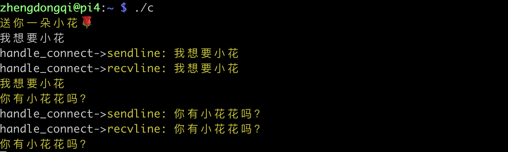

## poll原理

poll的机制与select类似，与select在本质上没有多大差别，管理多个描述符也是进行轮询，根据描述符的状态进行处理，但是poll没有最大文件描述符数量的限制。poll和select同样存在一个缺点就是，包含大量文件描述符的数组被整体复制于用户态和内核的地址空间之间，而不论这些文件描述符是否就绪，它的开销随着文件描述符数量的增加而线性增大。

## poll函数

函数格式如下所示：

```c
#include <poll.h>
int poll ( struct pollfd * fds, unsigned int nfds, int timeout);
```

pollfd结构体定义如下：

```c
struct pollfd {
		int fd;         			/* 文件描述符 */
		short events;         /* 等待的事件 */
		short revents;       	/* 实际发生了的事件 */
}; 
```

每一个pollfd结构体指定了一个被监视的文件描述符，可以传递多个结构体，指示poll()监视多个文件描述符。每个结构体的events域是监视该文件描述符的事件掩码，由用户来设置这个域。revents域是文件描述符的操作结果事件掩码，内核在调用返回时设置这个域。events域中请求的任何事件都可能在revents域中返回。合法的事件如下：

```c
POLLIN 　　　　　　　　//有数据可读。
POLLRDNORM 　　　　   //有普通数据可读。
POLLRDBAND　　　　　  //有优先数据可读。
POLLPRI　　　　　　　　//有紧迫数据可读。
POLLOUT　　　　　　   //写数据不会导致阻塞。
POLLWRNORM　　　　　  //写普通数据不会导致阻塞。
POLLWRBAND　　　　　  //写优先数据不会导致阻塞。
POLLMSGSIGPOLL 　　　//消息可用。

/*此外，revents域中还可能返回下列事件：*/
POLLER　　   				//指定的文件描述符发生错误。
POLLHUP　　 				//指定的文件描述符挂起事件。
POLLNVAL　　				//指定的文件描述符非法。
/*这些事件在events域中无意义，因为它们在合适的时候总是会从revents中返回*/
```

使用poll()和select()不一样，你不需要显式地请求异常情况报告。
　　POLLIN  |  POLLPRI等价于select( )的读事件，POLLOUT  | POLLWRBAND 等价于select( )的写事件。POLLIN 等价于POLLRDNORM  |  POLLRDBAND，而 POLLOUT 则等价于 POLLWRNORM。例如，要同时监视一个文件描述符是否可读和可写，我们可以设置 events 为POLLIN | POLLOUT。在 poll 返回时，我们可以检查 revents 中的标志，对应于文件描述符请求的 events 结构体。如果 POLLIN 事件被设置，则文件描述符可以被读取而不阻塞。如果 POLLOUT 被设置，则文件描述符可以写入而不导致阻塞。这些标志并不是互斥的：它们可能被同时设置，表示这个文件描述符的读取和写入操作都会正常返回而不阻塞。

　　timeout 参数指定等待的毫秒数，无论I/O是否准备好，poll 都会返回。timeout 指定为负数值表示无限超时，使 poll( )一直挂起直到一个指定事件发生；timeout 为 0 指示 poll 调用立即返回并列出准备好 I/O 的文件描述符，但并不等待其它的事件。这种情况下，poll( ) 就像它的名字那样，一旦选举出来，立即返回。 

返回值和错误代码
　　成功时，poll( ) 返回结构体中 revents 域不为 0 的文件描述符个数；如果在超时前没有任何事件发生，poll( )返回 0；失败时，poll( )返回-1，并设置 errno 为下列值之一：

```c
EBADF　　     //一个或多个结构体中指定的文件描述符无效。
EFAULTfds　　 //指针指向的地址超出进程的地址空间。
EINTR　　　　  //请求的事件之前产生一个信号，调用可以重新发起。
EINVALnfds　　//参数超出PLIMIT_NOFILE值。
ENOMEM　　    //可用内存不足，无法完成请求。
```

## poll测试

服务器端

```c
/*************************************************************************
	> File Name: poll_server.c
	> Author: zhengdongqi
	> Mail: 1821260963@qq.com
	> Created Time: Tue 09 Apr 2019 14:15:43 CST
 ************************************************************************/

#include <stdio.h>
#include <stdlib.h>
#include <string.h>
#include <errno.h>

#include <netinet/in.h>
#include <arpa/inet.h>
#include <sys/socket.h>
#include <poll.h>
#include <unistd.h>
#include <sys/types.h>

#ifdef _DEBUG
#define DBG(fmt, args...) printf(fmt, ##args)
#else
#define DBG(fmt, args...)
#endif

#define IPADDR      "192.168.1.44"
#define PORT        8731
#define MAXSIZE     1024
#define LISTENQ     5
#define OPEN_MAX    1000
#define INFTIM      -1

/*函数声明*/
/*创建套接字并进行绑定*/
int socket_bind(int port);
/*IO多路复用poll*/
void do_poll(int listenfd);
/*处理多个连接*/
void handle_connect(struct pollfd *pfds, int num);

int main() {
    DBG("\033[33m想要小🌹吗?\033[0m\n");
    fflush(stdout);
    int  listenfd;
    struct sockaddr_in socket_addr;
    listenfd = socket_bind(PORT);
    listen(listenfd, LISTENQ);
    do_poll(listenfd);
    return 0;
}

/*创建套接字并进行绑定*/
int socket_bind(int port) {
    int  listenfd;
    struct sockaddr_in socket_addr;
    listenfd = socket(AF_INET, SOCK_STREAM, 0);
    if (listenfd == -1) {
        DBG("socket_bind->\033[31m套接字创建失败: %s\033[0m\n", strerror(errno));
        return -1;
    }
    memset(&socket_addr, 0, sizeof(socket_addr));
    socket_addr.sin_family = AF_INET;
    socket_addr.sin_port = htons(port);
  	socket_addr.sin_addr.s_addr = htonl(INADDR_ANY);
 	//端口重用
    int reuse = 1;
    if (setsockopt(listenfd, SOL_SOCKET, SO_REUSEADDR, &reuse, sizeof(reuse)) == -1) {
        DBG("socket_bind->\033[31m设置端口重用失败: %s\033[0m\n", strerror(errno));
        close(listenfd);
        return -1;
    }
    if (bind(listenfd, (struct sockaddr*)&socket_addr, sizeof(socket_addr)) == -1) {
        DBG("socket_bind->\033[31m绑定失败: %s\033[0m\n", strerror(errno));
        return -1;
    }
    return listenfd;
}
/*IO多路复用破poll*/
void do_poll(int listenfd) {
    int poll_fd;
    struct sockaddr_in poll_addr;
    struct pollfd pfds[OPEN_MAX];
    int maxfd;
    int i;
    int nready;
    //添加监听描述符
    pfds[0].fd = listenfd;
    pfds[0].events = POLLIN;
    //初始化客户连接描述符
    for (i = 1; i < OPEN_MAX; i++) {
        pfds[i].fd = -1;
    }
    maxfd = 0;
    //循环处理
    for ( ; ; ) {
        //获取可用描述符的个数
        nready = poll(pfds, maxfd+1, INFTIM);
        if (nready == -1) {
            DBG("do_poll->\033[31mpoll error\033[0m\n");
            return ;
        }
        //测试监听描述符是否准备好
        if (pfds[0].revents & POLLIN) {
            socklen_t len = sizeof(poll_addr);
            //接受新的连接
            if ((poll_fd = accept(listenfd, (struct sockaddr*)&poll_addr, &len)) == -1) {
                if (errno == EINTR)
                    continue;
                else {
                   DBG("do_poll->\033[31maccept error\033[0m\n");
                   return ;
                }
            }
            DBG("do_poll->\033[33maccept a new client: %s->%d\033[0m\n", inet_ntoa(poll_addr.sin_addr), ntohs(poll_addr.sin_port));
            //将新的连接描述符添加到数组中
            for (i = 1; i < OPEN_MAX; i++) {
                if (pfds[i].fd < 0) {
                    pfds[i].fd = poll_fd;
                    break;
                }
            }
            if (i == OPEN_MAX) {
                DBG("\033[34m累死了😢\033[0m\n");
                return ;
            }
            //将新的描述符添加到读描述符集合中
            pfds[i].events = POLLIN;
            //记录客户连接套接字的个数
            maxfd = (i > maxfd ? i : maxfd);
            if (--nready <= 0)
                continue;
        }
        //处理客户连接
        handle_connect(pfds,maxfd);
    }
}

void handle_connect(struct pollfd *pfds, int num) {
    int i, n;
    char buf[MAXSIZE];
    memset(buf, 0, MAXSIZE);
    for (i = 1; i <= num; i++) {
        if (pfds[i].fd < 0)
            continue;
        //测试客户描述符是否准备好
        if (pfds[i].revents & POLLIN) {
            //接收客户端发送的信息
            n = read(pfds[i].fd, buf, MAXSIZE);
            if (n == 0) {
                close(pfds[i].fd);
                pfds[i].fd = -1;
                continue;
            }
            DBG("handle_connect->\033[33mread msg is: %s\033[0m", buf);
            write(STDOUT_FILENO, buf, n);
            //向客户端发送buf
            write(pfds[i].fd, buf, n);
        }
    }
}
```

客户端

```c
/*************************************************************************
	> File Name: poll_client.c
	> Author: zhengdongqi
	> Mail: 1821260963@qq.com
	> Created Time: Tue 09 Apr 2019 14:19:14 CST
 ************************************************************************/

#include <netinet/in.h>
#include <arpa/inet.h>
#include <sys/socket.h>
#include <stdio.h>
#include <string.h>
#include <stdlib.h>
#include <poll.h>
#include <time.h>
#include <unistd.h>
#include <sys/types.h>

#ifdef _DEBUG
#define DBG(fmt, args...) printf(fmt, ##args)
#else
#define DBG(fmt, args...)
#endif

#define MAXSIZE     1024
#define IPADDR      "192.168.1.44"
#define PORT        8731
/*处理连接*/
void handle_connect(int sockfd);

int main() {
    DBG("\033[33m送你一朵小花🌹\033[0m\n");
    fflush(stdout);
    int socket_fd;
    struct sockaddr_in  socket_addr;
    socket_fd = socket(AF_INET, SOCK_STREAM, 0);
    memset(&socket_addr, 0, sizeof(socket_addr));
    socket_addr.sin_family = AF_INET;
    socket_addr.sin_port = htons(PORT);
    socket_addr.sin_addr.s_addr = inet_addr(IPADDR);
    connect(socket_fd, (struct sockaddr*)&socket_addr,sizeof(socket_addr));
    //处理连接描述符
    handle_connect(socket_fd);
    return 0;
}
/*处理连接*/
void handle_connect(int socket_fd) {
    char sendline[MAXSIZE], recvline[MAXSIZE];
    struct pollfd pfds[2];
    int n;
    //添加连接描述符
    pfds[0].fd = socket_fd;
    pfds[0].events = POLLIN;
    //添加标准输入描述符
    pfds[1].fd = STDIN_FILENO;
    pfds[1].events = POLLIN;
    for (; ;) {
        poll(pfds, 2, -1);
        if (pfds[0].revents & POLLIN) {
            n = read(socket_fd, recvline, MAXSIZE);
            if (n == 0) {
                DBG("handle_connect->\033[31m服务器已关闭\033[0m\n");
                close(socket_fd);
            }
            DBG("handle_connect->\033[33mrecvline: %s\033[0m", recvline);
            write(STDOUT_FILENO, recvline, n);
        }
        //测试标准输入是否准备好
        if (pfds[1].revents & POLLIN) {
            n = read(STDIN_FILENO, sendline, MAXSIZE);
            if (n == 0) {
                shutdown(socket_fd, SHUT_WR);
                continue;
            }
            DBG("handle_connect->\033[33msendline: %s\033[0m", sendline);
            write(socket_fd, sendline, n);
        }
    }
}
```

## poll运行




## poll总结

`poll本质上和select没有区别，它将用户传入的数组拷贝到内核空间`，然后查询每个fd对应的设备状态，如果设备就绪则在设备等待队列中加入一项并继续遍历，如果遍历完所有fd后没有发现就绪设备，则挂起当前进程，直到设备就绪或者主动超时，被唤醒后它又要再次遍历fd。这个过程经历了多次无谓的遍历。 

它没有最大连接数的限制，`原因是它是基于链表来存储的`，但是同样有一个缺点：

`1）大量的fd的数组被整体复制于用户态和内核地址空间之间`，而不管这样的复制是不是有意义。

`2）poll还有一个特点是“水平触发”`，如果报告了fd后，没有被处理，那么下次poll时会再次报告该fd。 

注意：从上面看，select和poll都需要在返回后，`通过遍历文件描述符来获取已经就绪的socket`。事实上，`同时连接的大量客户端在一时刻可能只有很少的处于就绪状态`，因此随着监视的描述符数量的增长，其效率也会线性下降。