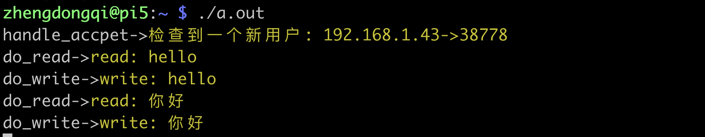
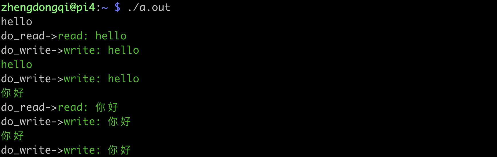

## epoll原理

epoll是在2.6内核中提出的，是之前的select和poll的增强版本。相对于select和poll来说，epoll更加灵活，没有描述符限制。epoll使用一个文件描述符管理多个描述符，将用户关系的文件描述符的事件存放到内核的一个事件表中，这样在用户空间和内核空间的copy只需一次。

## epoll函数

epoll操作过程需要三个接口，分别如下：

```c
#include <sys/epoll.h>
int epoll_create(int size);
int epoll_ctl(int epfd, int op, int fd, struct epoll_event *event);
int epoll_wait(int epfd, struct epoll_event * events, int maxevents, int timeout);
```

**（1） int epoll_create(int size);**
　　创建一个epoll的句柄，size用来告诉内核这个监听的数目一共有多大。这个参数不同于select()中的第一个参数，给出最大监听的fd+1的值。需要注意的是，当创建好epoll句柄后，它就是会占用一个fd值，在linux下如果查看/proc/进程id/fd/，是能够看到这个fd的，所以在使用完epoll后，必须调用close()关闭，否则可能导致fd被耗尽。

**（2）int epoll_ctl(int epfd,  int op,  int fd,  struct epoll_event  *event);**
　　epoll的事件注册函数，它不同与select()是在监听事件时告诉内核要监听什么类型的事件epoll的事件注册函数，它不同与select()是在监听事件时告诉内核要监听什么类型的事件，而是在这里先注册要监听的事件类型。第一个参数是epoll_create()的返回值，第二个参数表示动作，用三个宏来表示：

```c
EPOLL_CTL_ADD：//注册新的fd到epfd中；
EPOLL_CTL_MOD：//已经注册的fd的监听事件；
EPOLL_CTL_DEL：//pfd中删除一个fd；
```

第三个参数是需要监听的fd，第四个参数是告诉内核需要监听什么事，struct epoll_event结构如下：

```c
struct epoll_event {
  __uint32_t events;  /* Epoll events */
  epoll_data_t data;  /* User data variable */
};
```

events可以是以下几个宏的集合：

```c
EPOLLIN ：//表示对应的文件描述符可以读（包括对端SOCKET正常关闭）；
EPOLLOUT：//表示对应的文件描述符可以写；
EPOLLPRI：//表示对应的文件描述符有紧急的数据可读（这里应该表示有带外数据到来）；
EPOLLERR：//表示对应的文件描述符发生错误；
EPOLLHUP：//表示对应的文件描述符被挂断；
EPOLLET： //将EPOLL设为边缘触发(Edge Triggered)模式，这是相对于水平触发(Level Triggered)来说的。
EPOLLONESHOT：//只监听一次事件，当监听完这次事件之后，如果还需要继续监听这个socket的话，需要再次把这个socket加入到EPOLL队列里
```

**（3） int epoll_wait(int epfd, struct epoll_event \* events, int maxevents, int timeout);**
　　等待事件的产生，类似于select()调用。参数events用来从内核得到事件的集合，maxevents告之内核这个events有多大，这个maxevents的值不能大于创建epoll_create()时的size，参数timeout是超时时间（毫秒，0会立即返回，-1将不确定，也有说法说是永久阻塞）。该函数返回需要处理的事件数目，如返回0表示已超时。

## epoll模式

​	epoll对文件描述符的操作有两种模式：LT（level trigger）和ET（edge trigger）。LT模式是默认模式，LT模式与ET模式的区别如下：

　　LT模式：**当epoll_wait检测到描述符事件发生并将此事件通知应用程序，应用程序可以不立即处理该事件。下次调用epoll_wait时，会再次响应应用程序并通知此事件。**

　　ET模式：**当epoll_wait检测到描述符事件发生并将此事件通知应用程序，应用程序必须立即处理该事件。如果不处理，下次调用epoll_wait时，不会再次响应应用程序并通知此事件。**

　　**ET模式在很大程度上减少了epoll事件被重复触发的次数，因此效率要比LT模式高。epoll工作在ET模式的时候，必须使用非阻塞套接口，以避免由于一个文件句柄的阻塞读/阻塞写操作把处理多个文件描述符的任务饿死。**

## epoll测试

编写一个服务器回射程序echo，练习epoll过程。

```c
/*************************************************************************
	> File Name: epoll_server.c
	> Author: zhengdongqi
	> Mail: 1821260963@qq.com
	> Created Time: Mon 08 Apr 2019 19:10:21 CST
 ************************************************************************/

#include <stdio.h>
#include <stdlib.h>
#include <string.h>
#include <errno.h>

#include <netinet/in.h>
#include <sys/socket.h>
#include <arpa/inet.h>
#include <sys/epoll.h>
#include <unistd.h>
#include <sys/types.h>

#ifdef _DEBUG
#define DBG(fmt, args...) printf(fmt, ##args)
#else
#define DBG(fmt, args...)
#endif

#define IPADDR      "192.168.1.44"
#define PORT        8731
#define MAXSIZE     1024
#define LISTENQ     5
#define FDSIZE      1000
#define EPOLLEVENTS 100

/*函数声明*/
/*创建套接字并进行绑定*/
int socket_bind(int port);
/*IO多路复用epoll*/
void do_epoll(int listenfd);
/*事件处理函数*/
void handle_events(int epollfd, struct epoll_event *events, int num, int listenfd, char *buf);
/*处理接收到的连接*/
void handle_accpet(int epollfd, int listenfd);
/*读处理*/
void do_read(int epollfd, int fd, char *buf);
/*写处理*/
void do_write(int epollfd, int fd, char *buf);
/*添加事件*/
void add_event(int epollfd, int fd, int state);
/*修改事件*/
void modify_event(int epollfd, int fd, int state);
/*删除事件*/
void delete_event(int epollfd, int fd, int state);

int main() {
    int  listenfd;
    listenfd = socket_bind(PORT);
    listen(listenfd, LISTENQ);
    do_epoll(listenfd);
    return 0;
}
/*创建套接字并进行绑定*/
int socket_bind(int port) {
    int  listenfd;
    struct sockaddr_in socket_addr;
    listenfd = socket(AF_INET, SOCK_STREAM, 0);
    if (listenfd == -1) {
        DBG("socket_bind->\033[31m套接字创建失败: %s\033[0m\n", strerror(errno));
        return -1;
    }
    memset(&socket_addr, 0, sizeof(socket_addr));
    socket_addr.sin_family = AF_INET;
    socket_addr.sin_port = htons(port);
  	socket_addr.sin_addr.s_addr = htonl(INADDR_ANY);
 	//端口重用
    int reuse = 1;
    if (setsockopt(listenfd, SOL_SOCKET, SO_REUSEADDR, &reuse, sizeof(reuse)) == -1) {
        DBG("socket_bind->\033[31m设置端口重用失败: %s\033[0m\n", strerror(errno));
        close(listenfd);
        return -1;
    }
    if (bind(listenfd, (struct sockaddr*)&socket_addr, sizeof(socket_addr)) == -1) {
        DBG("socket_bind->\033[31m绑定失败: %s\033[0m\n", strerror(errno));
        return -1;
    }
    return listenfd;
}
/*IO多路复用epoll*/
void do_epoll(int listenfd) {
    int epollfd;
    struct epoll_event events[EPOLLEVENTS];
    int ret;
    char buf[MAXSIZE];
    memset(buf, 0, MAXSIZE);
    //创建一个描述符
    epollfd = epoll_create(FDSIZE);
    //添加监听描述符事件
    add_event(epollfd, listenfd, EPOLLIN);
    for ( ; ; ) {
        //获取已经准备好的描述符事件
        ret = epoll_wait(epollfd, events, EPOLLEVENTS, -1);
        handle_events(epollfd, events, ret, listenfd, buf);
    }
    close(epollfd);
}
/*事件处理函数*/
void handle_events(int epollfd, struct epoll_event *events, int num, int listenfd, char *buf) {
    int i;
    int fd;
    //进行选好遍历
    for (i = 0; i < num; i++) {
        fd = events[i].data.fd;
        //根据描述符的类型和事件类型进行处理
        if ((fd == listenfd) && (events[i].events & EPOLLIN))
            handle_accpet(epollfd, listenfd);
        else if (events[i].events & EPOLLIN)
            do_read(epollfd, fd, buf);
        else if (events[i].events & EPOLLOUT)
            do_write(epollfd, fd, buf);
    }
}
/*处理接收到的连接*/
void handle_accpet(int epollfd, int listenfd) {
  	struct sockaddr_in socket_addr;
    int len = sizeof(struct sockaddr_in), fd;
    fd = accept(listenfd, (struct sockaddr*)&socket_addr, (socklen_t *)&len);
    if (fd == -1) {
        DBG("handle_accpet->\033[31m接受套接字失败: %s\033[0m", strerror(errno));
    } else {
        DBG("handle_accpet->\033[33m检查到一个新用户: %s->%d\033[0m\n", inet_ntoa(socket_addr.sin_addr), ntohs(socket_addr.sin_port));

        //添加一个客户描述符和事件
        add_event(epollfd, fd, EPOLLIN);
    }
}
/*读处理*/
void do_read(int epollfd, int fd, char *buf) {
    int nread;
    nread = read(fd, buf, MAXSIZE);
    if (nread == -1) {
        DBG("do_read->\033[31m读❌\033[0m\n");
      	fflush(stdout);
        close(fd);
        delete_event(epollfd, fd, EPOLLIN);
    } else if (nread == 0) {
        DBG("\033[33m用户已下线\033[0m\n");
        close(fd);
        delete_event(epollfd, fd, EPOLLIN);
    } else {
        DBG("do_read->\033[33mread: %s\033[0m", buf);
        //修改描述符对应的事件，由读改为写
        modify_event(epollfd, fd, EPOLLOUT);
    }
}
/*写处理*/
void do_write(int epollfd, int fd, char *buf) {
    int nwrite;
    nwrite = write(fd, buf, strlen(buf));
    if (nwrite == -1) {
        DBG("do_write->\033[31m❌\033[0m\n");
      	fflush(stdout);
        close(fd);
        delete_event(epollfd, fd, EPOLLOUT);
    } else
        DBG("do_write->\033[33mwrite: %s\033[0m", buf);
        modify_event(epollfd, fd, EPOLLIN);
    memset(buf,0,MAXSIZE);
}
/*添加事件*/
void add_event(int epollfd, int fd, int state) {
    struct epoll_event ev;
    ev.events = state;
    ev.data.fd = fd;
    epoll_ctl(epollfd, EPOLL_CTL_ADD, fd,&ev);
}
/*删除事件*/
void delete_event(int epollfd, int fd, int state) {
    struct epoll_event ev;
    ev.events = state;
    ev.data.fd = fd;
    epoll_ctl(epollfd, EPOLL_CTL_DEL, fd,&ev);
}
/*修改事件*/
void modify_event(int epollfd, int fd, int state) {
    struct epoll_event ev;
    ev.events = state;
    ev.data.fd = fd;
    epoll_ctl(epollfd, EPOLL_CTL_MOD, fd,&ev);
}
```

客户端

```c
/*************************************************************************
	> File Name: epoll_client.c
	> Author: zhengdongqi
	> Mail: 1821260963@qq.com
	> Created Time: Mon 08 Apr 2019 19:15:59 CST
 ************************************************************************/
#include <netinet/in.h>
#include <sys/socket.h>
#include <stdio.h>
#include <string.h>
#include <stdlib.h>
#include <sys/epoll.h>
#include <time.h>
#include <unistd.h>
#include <sys/types.h>
#include <arpa/inet.h>

#ifdef _DEBUG
#define DBG(fmt, args...) printf(fmt, ##args)
#else
#define DBG(fmt, args...)
#endif

#define MAXSIZE     1024
#define IPADDR   	"192.168.1.44"
#define PORT   		8731
#define FDSIZE      1024
#define EPOLLEVENTS 20

/*处理连接*/
void handle_connection(int sockfd);
/*处理事件*/
void handle_events(int epollfd, struct epoll_event *events, int num, int sockfd, char *buf);
/*读处理*/
void do_read(int epollfd, int fd, int sockfd, char *buf);
/*写处理*/
void do_write(int epollfd, int fd, int sockfd, char *buf);
/*添加事件*/
void add_event(int epollfd, int fd, int state);
/*删除事件*/
void delete_event(int epollfd, int fd, int state);
/*修改事件*/
void modify_event(int epollfd, int fd, int state);

int main() {
    int socket_fd;
    struct sockaddr_in  socket_addr;
    socket_fd = socket(AF_INET, SOCK_STREAM, 0);
    memset(&socket_addr, 0, sizeof(socket_addr));
    socket_addr.sin_family = AF_INET;
    socket_addr.sin_port = htons(PORT);
  	socket_addr.sin_addr.s_addr = inet_addr(IPADDR);
    connect(socket_fd, (struct sockaddr*)&socket_addr, sizeof(socket_addr));
    //处理连接
    handle_connection(socket_fd);
    close(socket_fd);
    return 0;
}
/*处理连接*/
void handle_connection(int sockfd) {
    int epollfd;
    struct epoll_event events[EPOLLEVENTS];
    char buf[MAXSIZE];
    int ret;
    epollfd = epoll_create(FDSIZE);
    add_event(epollfd, STDIN_FILENO, EPOLLIN);
    for ( ; ; ) {
        ret = epoll_wait(epollfd, events, EPOLLEVENTS, -1);
        handle_events(epollfd, events, ret, sockfd, buf);
    }
    close(epollfd);
}
/*处理事件*/
void handle_events(int epollfd, struct epoll_event *events, int num, int sockfd, char *buf) {
    int fd;
    int i;
    for (i = 0;i < num;i++) {
        fd = events[i].data.fd;
        if (events[i].events & EPOLLIN)
            do_read(epollfd, fd, sockfd, buf);
        else if (events[i].events & EPOLLOUT)
            do_write(epollfd, fd, sockfd, buf);
    }
}
/*读处理*/
void do_read(int epollfd, int fd, int sockfd, char *buf) {
    int nread;
    nread = read(fd,buf,MAXSIZE);
    if (nread == -1) {
        DBG("do_read->\033[31m❌\033[0m\n");
		fflush(stdout);
        close(fd);
    } else if (nread == 0) {
        DBG("do_read->\033[31m服务器关闭\033[0m\n");
        close(fd);
    } else {
        if (fd == STDIN_FILENO) {
            DBG("do_read->\033[32mread: %s\033[0m", buf);
            add_event(epollfd, sockfd, EPOLLOUT);
        } else {
            delete_event(epollfd, sockfd, EPOLLIN);
            add_event(epollfd, STDOUT_FILENO, EPOLLOUT);
        }
    }
}
/*写处理*/
void do_write(int epollfd, int fd, int sockfd, char *buf) {
    int nwrite;
    nwrite = write(fd, buf, strlen(buf));
    if (nwrite == -1) {
        DBG("do_write->\033[31m❌\033[0m\n");
 		fflush(stdout);
        close(fd);
    } else {
        if (fd == STDOUT_FILENO) {
            DBG("do_write->\033[32mwrite: %s\033[0m", buf);
            delete_event(epollfd, fd, EPOLLOUT);
        } else {
            DBG("do_write->\033[32mwrite: %s\033[0m", buf);
            modify_event(epollfd, fd, EPOLLIN);
        }
    }
    memset(buf, 0, MAXSIZE);
}
/*添加事件*/
void add_event(int epollfd, int fd, int state) {
    struct epoll_event ev;
    ev.events = state;
    ev.data.fd = fd;
    epoll_ctl(epollfd, EPOLL_CTL_ADD, fd, &ev);
}
/*删除事件*/
void delete_event(int epollfd, int fd, int state) {
    struct epoll_event ev;
    ev.events = state;
    ev.data.fd = fd;
    epoll_ctl(epollfd, EPOLL_CTL_DEL, fd,&ev);
}
/*修改事件*/
void modify_event(int epollfd, int fd, int state) {
    struct epoll_event ev;
    ev.events = state;
    ev.data.fd = fd;
    epoll_ctl(epollfd, EPOLL_CTL_MOD, fd, &ev);
}
```

## epoll运行





## epoll总结

epoll的优点：

`1、没有最大并发连接的限制`，能打开的FD的上限远大于1024（1G的内存上能监听约10万个端口）。

`2、效率提升，不是轮询的方式，不会随着FD数目的增加效率下降`。

　　只有活跃可用的FD才会调用callback函数；`即Epoll最大的优点就在于它只管你“活跃”的连接，而跟连接总数无关`，因此在实际的网络环境中，Epoll的效率就会远远高于select和poll。

`3、内存拷贝`，利用mmap()文件映射内存加速与内核空间的消息传递；`即epoll使用mmap减少复制开销`。

注意：如果没有大量的idle-connection或者dead-connection，epoll的效率并不会比select/poll高很多，但是当遇到大量的idle-connection，就会发现epoll的效率大大高于select/poll。